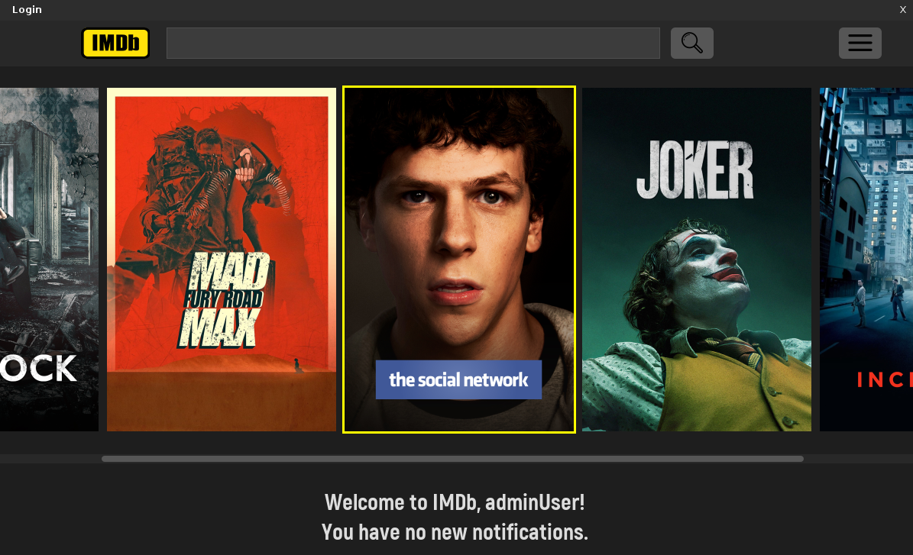
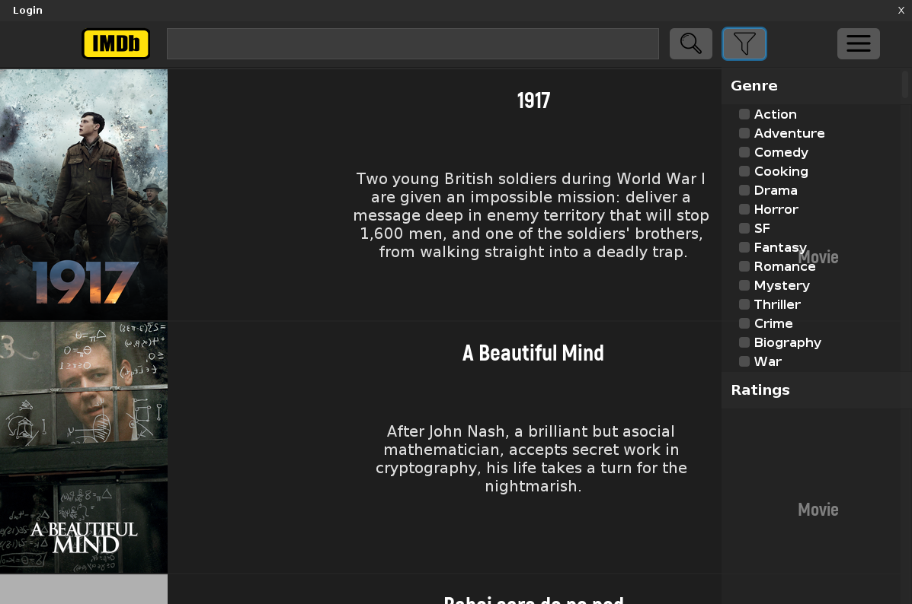

# My_IMDb

Welcome to **My_IMDb**, a project designed to simulate the core functionalities of the [Internet Movie Database (IMDb)](https://www.imdb.com/). This application showcases Object-Oriented Programming (OOP) concepts such as inheritance, polymorphism, encapsulation, and the use of design patterns. It also provides two user interfaces: a terminal (console-based) and a Graphical User Interface (GUI) built with **Java Swing**.



---

## Table of Contents

1. [Overview](#overview)  
2. [Features](#features)  
3. [Architecture & Main Components](#architecture--main-components)  
4. [Design Patterns](#design-patterns)  
5. [Graphical User Interface](#graphical-user-interface)  
6. [Terminal Mode](#terminal-mode)  
7. [Dependencies](#dependencies)  
8. [How to Build & Run](#how-to-build--run)  
9. [Future Improvements & Bonus Ideas](#future-improvements--bonus-ideas)  
10. [Requirements (Originally in Romanian)](#requirements-originally-in-romanian)  
11. [License](#license)

---

## Overview

The **My_IMDb** is an OOP project that allows users to explore, search, and manage a local movie and TV series database (similar to IMDb). Users can:

- **View** detailed information about productions (movies, series) and actors.
- **Search** for specific titles or actors.
- **Manage** favorite lists (add/remove films, series, or actors).
- **Rate** movies and series, leave comments.
- **Create, track, and resolve requests** (complaints, updates, or account deletion, etc.).
- **Administrators** and **contributors** can add, update, and delete productions or actors, as well as respond to user requests. Administrators also manage user accounts.

This application can be used in either:
1. **Terminal Mode** – a text-based console interface.  
2. **GUI Mode** – a desktop interface built with Java Swing for a more user-friendly, visual experience.



---

## Features

Below is a summary of the main functionalities:

- **User Authentication**  
  - Users log in with credentials.  
  - Failed login attempts allow retrial.  
  - Different user types have different permissions:  
    - **Regular**: can view productions and actors, rate movies/series, create requests, add to favorites, etc.  
    - **Contributor**: can do everything a Regular does, plus add/update/delete the productions/actors they contributed. They also handle requests specifically targeting the content they created.  
    - **Admin**: has the highest privileges, can do everything a Contributor does, can manage all productions/actors (including those left behind by deleted contributor accounts), and can add or remove users from the system.

- **Production & Actor Management**  
  - View movies, series, and actors with sorting and filtering options.  
  - Contributors and admins can add, update, and remove productions or actors.  
  - Ratings and reviews are stored, displayed, and sorted based on user experience points.

- **Favorites List**  
  - Each user has a sorted set of favorite items (movies, series, actors).  
  - Users can easily add or remove items to/from this list.

- **Requests System**  
  - Regular or contributor users can create requests (e.g., “Delete account,” “Actor issue,” “Movie issue,” “Other”).  
  - Requests are routed to the responsible staff (the contributor who added the item or, if none, the admin team) or to all admins.  
  - Staff users can **resolve** or **reject** requests.  
  - Notifications are sent to the request owner upon resolution or rejection.

- **Notifications**  
  - Implemented using the **Observer** pattern.  
  - Users automatically receive notifications about new events relevant to them (e.g., new ratings on productions they created, request status updates).

- **Rating System**  
  - Only **Regular** users can rate.  
  - Ratings are integers `[1..10]`, with optional text comments.  
  - Overall production rating is the average of all user ratings.  
  - Ratings from more experienced users are shown first.

- **Experience Points**  
  - **Regular** and **Contributor** users gain experience for certain actions (rating a production, getting certain requests resolved, adding productions/actors).  
  - Admins have “infinite” or unchanging experience.

---

## Architecture & Main Components

The project is heavily organized around OOP principles, with classes broken into logical groups.

### Conceptual Class Diagram

                 ┌────────────┐
                 │   IMDB*    │  (Singleton)
                 └────────────┘
                       │
       ┌─────────────────────────────────────┐
       │                                     │
       ▼                                     ▼
┌────────────────────────────┐       ┌───────────────────────────────────┐
│        Production          │       │              Actor                │ 
│ (abstract, Comparable)     │       └───────────────────────────────────┘
└────────────────────────────┘                ▲
        ▲                 ▲                   │
        │                 │                   │
 ┌─────────────┐     ┌─────────────┐   ┌───────────────────────────────────┐
 │    Movie    │     │   Series    │   │           RequestsHolder          │ (static)
 └─────────────┘     └─────────────┘   └───────────────────────────────────┘
                                           ▲
                                           │
                                 ┌───────────────────┐
                                 │     Request       │
                                 └───────────────────┘

                                     ┌───────────┐
                                     │   Rating  │
                                     └───────────┘

                     ┌────────────────────┐
                     │   User (abstract)  │
                     │  SortedSet<T> favs │
                     └────────────────────┘
                                ▲
                                │
       ┌───────────────────────────────────────────┐
       │                                           │
       ▼                                           ▼
┌────────────────────┐                     ┌─────────────────────────────┐
│  Regular (RequestsMgr) │               │    Staff (abstract)         │
└────────────────────┘                     │ extends User, StaffInterface│
                                           └─────────────────────────────┘
                                                  ▲               ▲
                                                  │               │
                                      ┌───────────────────┐  ┌───────────────────────┐
                                      │  Contributor      │  │       Admin           │
                                      │ (RequestsMgr)     │  └───────────────────────┘
                                      └───────────────────┘ 


### Key Classes

- **IMDB (Singleton)**  
  The application’s main class responsible for:  
  - Loading data (users, productions, requests) from JSON files.  
  - Running the authentication flow.  
  - Directing user operations based on their role.

- **Production (abstract)**  
  - Represents any cinematic production (Movie or Series).  
  - Stores title, directors, actors, genre list, ratings, and a description.  
  - Averages user ratings.  
  - Comparable by title.

- **Movie**  
  - Extends `Production` and includes specific fields such as release year, duration, etc.

- **Series**  
  - Extends `Production` and includes number of seasons, release year, episodes stored in a `Map<Season, List<Episode>>`.

- **Actor**  
  - Stores the actor’s name, known roles (with movie/series type), and optional biography.

- **User (abstract)**  
  - Stores user information, credentials, experience points, notifications, and favorites (a `SortedSet` of movies/series/actors).  
  - Has subclasses `Regular`, `Contributor`, and `Admin`.

- **Regular**  
  - Implements `RequestsManager` (create and remove requests).  
  - Can rate productions, view, and manage favorites.

- **Staff (abstract)**  
  - Extends `User` and includes staff-only functionalities: add/update/remove productions or actors, and handle relevant requests.  
  - Subclasses: `Contributor` and `Admin`.

- **Contributor**  
  - Like a regular user but can add/update/remove only what they contributed.  
  - Also implements `RequestsManager`.

- **Admin**  
  - The highest-privileged user.  
  - Can add/remove users from the system in addition to all the staff capabilities.  
  - Manages productions/actors introduced by other admins or from deleted contributor accounts.

- **Request & RequestsHolder**  
  - `Request` objects store request type (using an enum `RequestType`), creation date, a title/subject, a description, the requester’s username, and the target resolver’s username (or “ADMIN”).  
  - `RequestsHolder` (static) maintains a global list of requests (available to all admins) as well as methods to add/remove these requests.

- **Rating**  
  - Represents a user’s rating for a production (score in `[1..10]` and optional comment).

- **Information & Credentials**  
  - `Information` is built using the **Builder** pattern and includes personal data such as name, country, gender, and birthdate.  
  - `Credentials` has private fields for email and password, following the principle of **encapsulation**.

---

## Design Patterns

This project integrates several well-known design patterns:

1. **Singleton**  
   - Ensures only one instance of the `IMDB` class exists.  
   - Used to manage the application’s global state and data loading.

2. **Builder**  
   - Used to construct `Information` objects step by step (helps when many optional parameters exist).

3. **Factory**  
   - `UserFactory` creates concrete user objects (`Regular`, `Contributor`, or `Admin`) based on an `AccountType` enum.

4. **Observer**  
   - Implements the **notifications** system.  
   - Productions or Requests act as the “subject,” while users (Regular, Contributor, Admin) act as “observers.” When a rating or request is added/updated, observers are notified accordingly.

5. **Strategy**  
   - Handles how a user’s **experience points** increase for different actions (rating, adding new productions, creating certain requests).  
   - Each action is encapsulated in a separate strategy class that calculates how many experience points should be awarded.

---

## Graphical User Interface

Developed using **Java Swing**, the GUI is designed for ease of use and intuitive navigation:

- **Login Screen**  
  - Users enter their credentials.  
  - Failed attempts prompt users to re-enter data.

- **Home Screen**  
  - Displays a set of **recommended movies and series**.  
  - Shows the **notifications** panel (or a message indicating no new notifications).  
  - Features a **search bar** for movies, series, and actors.  
  - A clickable **logo** (IMDb) that always brings you back to this home page.

- **Side Menu**  
  - Accessible via a menu button; it contains all available actions based on the user type (Regular, Contributor, Admin).  
  - Allows navigation to:  
    - **Movies** (list or grid view with optional filters like genre or minimum ratings).  
    - **Actors** (sorted list of actors; can be filtered).  
    - **My Favorites**.  
    - **My Profile** (view personal information and experience).  
    - **My Requests** (for regular/contributors to view or add requests).  
    - **Solve Requests** (for contributors/admins to see and act on incoming requests).  
    - **Manage Users** (admin-only).  
    - **Logout**.

- **Movies and Actors Pages**  
  - Shows a **list of items**.  
  - Selecting an item opens a detailed view, showing all specific info, rating, etc.  
  - Presents applicable options:  
    - For **Regular**: rate, add to favorites, or create a request.  
    - For **Contributor**: same as Regular, plus the ability to modify or delete productions/actors they added.  
    - For **Admin**: similar to Contributor functionality, plus user management, and no personal “create request” for their own content.

- **Favorites Page**  
  - Displays the user’s favorited actors and productions.  
  - Selecting an item again allows you to see details or remove it from favorites.

- **Contributions Page** (Contributor/Admin)  
  - Lists **all** items they have added.  
  - Allows adding new contributions, updating, or removing existing ones.

- **Requests Page**  
  - **Regular/Contributor**: lists requests they have submitted (can withdraw), and a button to create a new request.  
  - **Contributor/Admin**: a separate section “Solve Requests” to view and respond to assigned or global requests.

- **Profile Page**  
  - Displays user’s personal info, email, experience points, etc.

---

## Dependencies

- **[com.formdev:flatlaf:3.2.5](https://github.com/JFormDesigner/FlatLaf)**  
  Used to give the Java Swing application a modern, minimal look.

- **[org.passay:passay:1.6.0](https://github.com/vt-middleware/passay)**  
  Helps handle and validate password complexity and security.


## How to Build & Run

1. **Clone the Repository**  
   ```bash
   git clone https://github.com/your_username/imdb-like-application.git
   cd imdb-like-application
   ./gradlew clean build
   ./gradle run

   Select are user from request.json file to login (e.g., "username": "test", "password": "test")

